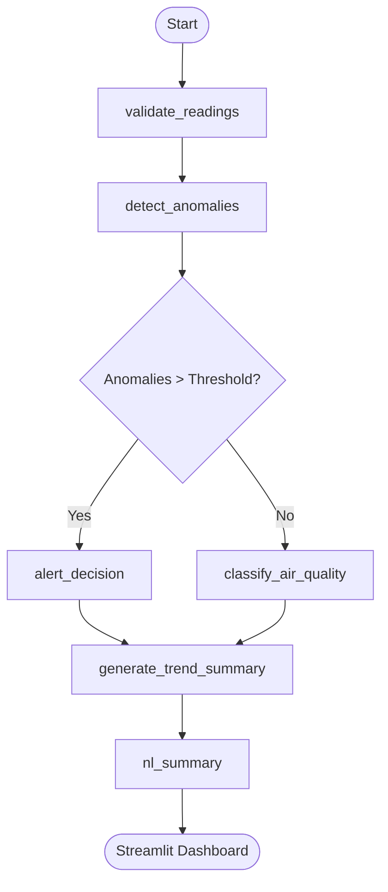

# 🌫️ Air Quality Insight & Alert Agent

[](https://www.python.org/)
[](https://langchain-ai.github.io/langgraph/)
[](https://ollama.ai/)
[](https://streamlit.io/)

A production-ready **AI Agent** built with **LangGraph** and **Ollama** to monitor, analyze, and alert on air quality data. This project demonstrates how to orchestrate multi-step data reasoning, handle conditional logic, and provide human-readable insights through a polished dashboard.

---

## 🚀 Overview

This agent processes PM2.5 and PM10 time-series data to:
- **Clean & Validate**: Ensure data integrity.
- **Detect Anomalies**: Identify hazardous spikes in pollution.
- **Multi-Step Reasoning**: Use conditional logic to trigger alerts or classify air quality.
- **AI Insights**: Generate natural language summaries of trends using local LLMs.

### 📊 Workflow Architecture

The agent's reasoning process is managed by a stateful graph:



---

## 🛠️ Tech Stack

| Category | Tools |
| :--- | :--- |
| **Orchestration** | **LangGraph** (State management, cyclic graphs) |
| **Intelligence** | **Ollama** (Llama 3 / Mistral for local reasoning) |
| **Processing** | **Pandas**, **NumPy** |
| **UI/UX** | **Streamlit** (Interactive Dashboard) |
| **Visualization** | **Plotly** (Dynamic time-series charts) |

---

## 🧠 Why LangGraph?

For this demo, I chose **LangGraph** because it moves beyond simple "chains" to actual "graphs." This allows for:
1.  **State Persistence**: Using `MemorySaver` to maintain data context across multiple analysis steps.
2.  **Human-in-the-loop (HITL)**: Handled via `interrupt_before`, requiring human approval before finalized alerts.
3.  **Self-Correction Cycles**: A feedback loop where the agent critiques its own summary and refines it if necessary.
4.  **Separation of Concerns**: Each node is a discrete Python function, making the system modular and testable.

---

## 📈 Screenshots

> [!TIP]
> Add your own screenshots in the `example_runs/` folder to showcase your work!

| Trend Analysis | Anomaly Detection |
| :---: | :---: |
|  |  |
| *Visualizing PM2.5/PM10 trends with AI insights.* | *Automatic spike detection and alert triggers.* |

---

## 📂 Project Structure

```bash
air-quality-agent/
├── app.py             # Streamlit Dashboard (UI Layer)
├── graph/             # Core Agent Logic
│   ├── nodes.py       # Node functions (Business logic)
│   ├── workflow.py    # Graph construction & state machine
│   └── state.py       # TypedState definitions
├── data/              # Dataset storage
├── diagrams/          # Architecture visuals
└── requirements.txt   # Dependencies
```

---

## ⚙️ Getting Started

### 1. Prerequisites
- **Python 3.10+**
- **Ollama** installed and running (e.g., `ollama serve`)

### 2. Installation
```bash
# Clone the repo
git clone https://github.com/YOUR_USERNAME/air-quality-agent.git
cd air-quality-agent

# Set up virtual environment
python -m venv venv
source venv/bin/activate  # On Windows: venv\Scripts\activate

# Install dependencies
pip install -r requirements.txt
```

### 3. Usage
1.  Place your dataset at `data/air_quality.csv`.
2.  Run the dashboard:
```bash
streamlit run app.py
```

---

## 🎯 Roadmap & Enhancements
- [ ] **Rolling Forecasts**: Predict next-day PM2.5 using statistical models.
- [ ] **Multi-City Support**: Expand the agent to handle multiple sensor locations.
- [ ] **External Alerts**: Integrate with Slack/Email APIs for real-time notifications.
- [ ] **Historical RAG**: Allow the agent to query historical month-over-month data.

---

## 📬 Contact

**Sara Taherimonfared**
- Email: [sara.taherimonfared@gmail.com](mailto:sara.taherimonfared@gmail.com)
- LinkedIn: [My Profile](https://www.linkedin.com/in/sara-taheri-monfared-phd-45946248/)

---
*Created as a learning project to master LangGraph and production-grade AI Agent design.*
